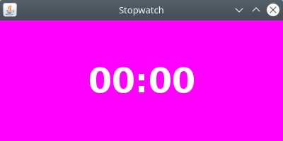

# Stopwatch Bot
This is a Clojure application that provides a stopwatch bot.

## Getting Started
These instructions will get you a copy of the project up and running on your local machine.

### Prerequisites
You need to have [Clojure](https://clojure.org/) installed on your machine. 

### Installation
Clone the repository:
```bash
git clone https://github.com/frankbuss/stopwatchbot.git
```
Navigate into the project directory:
```bash
cd stopwatchbot
```
Copy the template environment file to create your own config.env:
```bash
cp config.env.template config.env
```
Open the config.env file and fill in the USERNAME, TOKEN, CHANNEL, and ALLOWED variables, and change the FONT if needed. [Here](https://dev.twitch.tv/docs/authentication/getting-tokens-oauth/) is explained how to get the OAUTH token for Twitch.

## Usage
Start the bot by running the run.sh script:
```bash
./run.sh
```
You will see output like this:
```
Starting bot...
Connection established...
Sending token
Sending: NICK 10x_programmer
Sending: JOIN #10x_programmer
Sending: PRIVMSG #10x_programmer :stopwatch-bot ready
```
and a window like this will open:



The magenta background (color `#ff00ff`) makes it easier to integrate it in OBS with transparent background.

From the chat where the bot has joined, you can now start the countdown. There are three ways to specify the time:

1. SS (Seconds):
   - Use this format to represent time in seconds only.
   - Example: `!sw 35` represents 35 seconds.

2. MM:SS (Minutes:Seconds):
   - Use this format to represent time in minutes and seconds.
   - Example: `!sw 2:45` represents 2 minutes and 45 seconds.

3. HH:MM:SS (Hours:Minutes:Seconds):
   - Use this format to represent time in hours, minutes, and seconds.
   - Example: `!sw 1:15:30` represents 1 hour, 15 minutes, and 30 seconds.
   